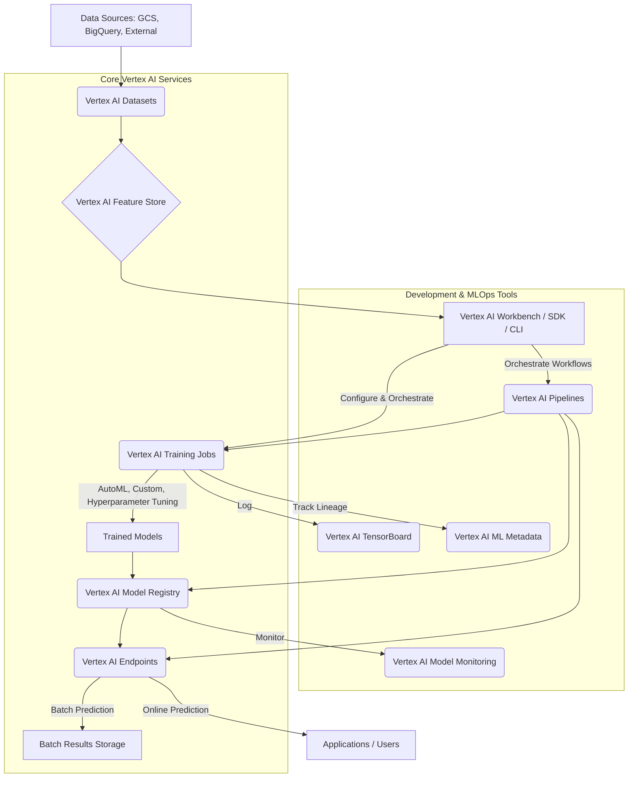

<!--
  Generated by AI-Powered README Generator
  Repository: https://github.com/GDSC-FSC/vertex-ai-samples
  Generated: 2025-10-07T18:11:15.503Z
  Format: md
  Style: comprehensive
-->

#  Google Cloud Vertex AI Samples

Accelerate your ML and Generative AI workflows with comprehensive samples on Google Cloud Vertex AI.

[](https://github.com/GDSC-FSC/vertex-ai-samples/actions/workflows/ci.yaml)
[](https://github.com/GDSC-FSC/vertex-ai-samples/blob/main/LICENSE)
[](https://github.com/GDSC-FSC/vertex-ai-samples/commits/main)
[](https://www.python.org/)

---

## 🚀 Table of Contents

- [Overview](#-overview)
- [Feature Highlights](#-feature-highlights)
- [Core Architecture & Technology Stack](#-core-architecture--technology-stack)
- [Getting Started](#-getting-started)
  - [Prerequisites](#prerequisites)
  - [Installation](#installation)
  - [Configuration](#configuration)
  - [Running Samples (Development & Production)](#running-samples-development--production)
- [Usage Examples & Workflows](#-usage-examples--workflows)
  - [Train and Deploy a Custom Image Classification Model](#train-and-deploy-a-custom-image-classification-model)
  - [Orchestrating ML Workflows with Pipelines](#orchestrating-ml-workflows-with-pipelines)
  - [Leveraging Model Garden for LLMs](#leveraging-model-garden-for-llms)
- [Limitations, Known Issues & Future Roadmap](#-limitations-known-issues--future-roadmap)
- [Contributing & Development Guidelines](#-contributing--development-guidelines)
- [License, Credits & Contact](#-license-credits--contact)
- [Appendix](#-appendix)
  - [Changelog](#changelog)
  - [FAQ](#faq)
  - [Troubleshooting Guide](#troubleshooting-guide)
  - [API References](#api-references)

---

## 📖 Overview

Welcome to the **Google Cloud Vertex AI Samples** repository! This collection provides a wealth of notebooks, code samples, and resources designed to help you master machine learning (ML) and generative AI (GenAI) workflows using Google Cloud's powerful [Vertex AI platform](https://cloud.google.com/vertex-ai).

**Purpose & Goals:**
This repository aims to:
- **Demystify Vertex AI:** Provide practical, hands-on examples for common and advanced ML/GenAI tasks.
- **Accelerate Development:** Offer ready-to-use code and notebooks to kickstart your projects.
- **Foster Learning:** Serve as an educational resource for users new to Vertex AI and a reference for experienced practitioners.
- **Enable Contribution:** Encourage community contributions to expand the breadth and depth of samples.

**Why it Matters / Problem it Solves:**
Vertex AI unifies the entire ML lifecycle—from data preparation and model training to deployment, monitoring, and MLOps. This repository addresses the challenge of understanding and integrating these diverse services by providing concrete, tested examples. It helps users navigate the platform's capabilities, implement best practices, and build scalable, production-ready ML solutions.

**Target Audience:**
- **ML Engineers & Data Scientists:** Looking for practical examples to implement their models on Vertex AI.
- **Developers:** Interested in integrating AI capabilities into their applications.
- **Researchers:** Exploring advanced ML/GenAI techniques on a robust cloud infrastructure.
- **Students & Learners:** Seeking to understand and experiment with cloud-based ML.

<p align="right">(<a href="#-table-of-contents">Back to top</a>)</p>

---

## ✨ Feature Highlights

This repository showcases a broad range of Vertex AI capabilities, categorized for easy exploration:

-   **🤖 Model Garden Integration**
    *   ✅ **Curated Model Collection:** Access and deploy first-party, open-source, and third-party models including Gemini, Gemma, Llama 3, Claude 3, and more.
    *   💡 **Fine-tuning & Deployment:** Examples for fine-tuning popular LLMs like Llama 2/3, Gemma, Mistral, and Falcon with PEFT (Parameter-Efficient Fine-Tuning) and deploying them on Vertex AI Endpoints.
    *   🔍 **Benchmarking Reports:** See how different models perform with included benchmarking reports (e.g., `jax_vit_benchmarking_report.md`).

-   **⚙️ Core ML Platform Capabilities**
    *   **Data Management:**
        *   ✅ **Feature Store:** Set up and manage online/offline feature serving with Vertex AI Feature Store, including streaming ingestion.
        *   ✅ **Datasets:** Utilize BigQuery and Data Labeling services for efficient data preparation and management.
        *   💡 **Data Transformation:** Examples for splitting, filling missing values, and selecting columns in CSVs using pipeline components.
    *   **Model Training:**
        *   ✅ **AutoML:** Train and predict with AutoML models for various data types: Image Classification/Object Detection, Text Classification/Entity Extraction/Sentiment Analysis, Tabular Classification/Regression/Forecasting.
        *   ✅ **Custom Training:** Create, train, and deploy custom models using popular frameworks like TensorFlow/Keras, PyTorch, Scikit-learn, and XGBoost, with options for custom or pre-built containers.
        *   🚀 **Distributed Training:** Examples for multi-worker distributed training (TF/Keras, PyTorch DDP/FSDP) and hyperparameter tuning.
        *   🔍 **Persistent Resource:** Optimize training with persistent compute resources.
    *   **Model Deployment & Prediction:**
        *   ✅ **Endpoints:** Deploy models to managed Vertex AI Endpoints for online prediction, batch prediction, and explainable AI.
        *   ✅ **Custom Prediction Routines (CPR):** Implement custom pre/post-processing logic for tailored serving.
        *   💡 **Optimized Runtimes:** Leverage optimized TensorFlow and PyTorch runtimes for high-performance inference.
        *   ✅ **NVIDIA Triton Inference Server:** Deploy models with Triton for multi-model serving and dynamic batching.
    *   **MLOps & Governance:**
        *   ✅ **Vertex AI Pipelines (KFP):** Orchestrate end-to-end ML workflows using Kubeflow Pipelines (KFP) v1/v2 and Google Cloud Pipeline Components.
        *   ✅ **Model Registry:** Manage model versions, metadata, and lifecycle with Vertex AI Model Registry.
        *   ✅ **Explainable AI (XAI):** Generate feature-based and example-based explanations for model predictions.
        *   ✅ **ML Metadata:** Record and query metadata, artifacts, and lineage for reproducibility and auditing.
        *   ✅ **Model Monitoring:** Detect model drift, data drift, and data quality issues for deployed models.
        *   ✅ **Hyperparameter Tuning:** Optimize model performance using Vertex Vizier and built-in hyperparameter tuning services.

-   **🌐 Generative AI Examples**
    *   ✅ **LLM Integration:** Snippets for interacting with foundational models like `text-bison`, `code-bison`, and various open-source LLMs.
    *   💡 **Text Embeddings:** Generate high-quality embeddings for semantic search and RAG (Retrieval Augmented Generation).
    *   🚀 **LLM Fine-tuning:** Examples demonstrating fine-tuning of open-source LLMs for specific tasks.
    *   ✅ **Evaluation:** Use AutoSxS for LLM evaluation.

-   **🛠️ Tools & Environments**
    *   ✅ **Vertex AI Workbench:** Tutorials for developing directly within managed Jupyter notebooks.
    *   ✅ **Ray on Vertex AI:** Utilize Ray clusters for distributed Python workloads.
    *   ✅ **TensorBoard:** Visualize training metrics, profiles, and debug models.

<p align="right">(<a href="#-table-of-contents">Back to top</a>)</p>

---

## 🏛️ Core Architecture & Technology Stack

This repository provides samples that interact with the various components of Google Cloud Vertex AI, designed to support the entire machine learning lifecycle. The high-level architecture demonstrated across the samples often follows a common pattern:



**Explanation of Components:**

*   **Data Sources:** Raw data resides in various storage options like Cloud Storage (GCS) or BigQuery.
*   **Vertex AI Datasets:** Managed datasets for images, text, tabular, and video, used for AutoML and custom training.
*   **Vertex AI Feature Store:** A centralized repository for managing, serving, and sharing ML features at scale, both online and offline.
*   **Vertex AI Workbench / SDK / CLI:** The primary interfaces for interacting with Vertex AI. Workbench provides managed Jupyter notebooks, while the SDK and CLI enable programmatic control and automation.
*   **Vertex AI Training Jobs:** Services for training models.
    *   **AutoML:** High-level, no-code/low-code training for common ML tasks.
    *   **Custom Training:** Flexible training with custom code and containers, supporting various frameworks.
    *   **Hyperparameter Tuning:** Optimizes model performance by efficiently searching for the best hyperparameters.
*   **Trained Models:** The output of training jobs.
*   **Vertex AI Model Registry:** A central repository to manage the lifecycle of ML models, including versioning, metadata, and deployment.
*   **Vertex AI Endpoints:** Managed prediction endpoints for deploying models for online (real-time) or batch (offline) inference.
*   **Applications / Users:** Consume online predictions.
*   **Batch Results Storage:** Stores results of batch predictions.
*   **Vertex AI Model Monitoring:** Continuously monitors deployed models for data drift, concept drift, and prediction quality.
*   **Vertex AI TensorBoard:** A managed service for visualizing ML experiments, training runs, and debugging models.
*   **Vertex AI ML Metadata:** Tracks and records metadata about ML artifacts (datasets, models) and executions (training runs, pipeline steps) for lineage and reproducibility.
*   **Vertex AI Pipelines:** Orchestrates complex ML workflows as directed acyclic graphs (DAGs), integrating various Vertex AI services and custom components.

**Technology Stack:**

The samples in this repository primarily leverage the following technologies:

*   **Programming Languages:** Python (dominant), YAML (for component definitions), Shell Scripting.
*   **Machine Learning Frameworks:**
    *   **TensorFlow / Keras:** For deep learning, image classification, text classification, etc.
    *   **PyTorch:** For deep learning, distributed training, custom models.
    *   **Scikit-learn:** For traditional machine learning tasks.
    *   **XGBoost:** For gradient boosting models.
    *   **Hugging Face Transformers / Diffusers:** For large language models (LLMs) and generative AI.
    *   **Jax / Flax:** For high-performance deep learning.
*   **Google Cloud Services:**
    *   **Vertex AI:** The core platform, including Datasets, Feature Store, Training (Custom, AutoML, HPT), Pipelines (KFP), Model Registry, Endpoints, Monitoring, TensorBoard, ML Metadata, Workbench.
    *   **Cloud Storage (GCS):** For storing datasets, models, and artifacts.
    *   **BigQuery:** For large-scale data warehousing and analytics, often used as a data source or for feature engineering.
    *   **Cloud Build:** For CI/CD (e.g., notebook testing).
    *   **Artifact Registry:** For storing Docker images used in custom training and prediction.
    *   **Dataflow / Dataproc:** For large-scale data processing (though less explicitly in samples, often implicitly used in pipelines).
*   **Containerization:** Docker for building custom training and prediction containers.
*   **Orchestration:** Kubeflow Pipelines (KFP) for defining and running ML workflows.

<p align="right">(<a href="#-table-of-contents">Back to top</a>)</p>

---

## 🏁 Getting Started

To explore and run the samples in this repository, you'll need a Google Cloud Project and a suitable development environment.

### Prerequisites

Before you begin, ensure you have the following:

1.  **Google Cloud Project:**
    *   If you don't have one, create a new project and enable billing. You can start with a [Free Trial](https://cloud.google.com/free).
    *   Ensure the following APIs are enabled in your project:
        *   Vertex AI API
        *   Cloud Storage API
        *   Artifact Registry API
        *   Compute Engine API
        *   Dataflow API (if running Dataflow components)
        *   BigQuery API (if using BigQuery)

2.  **Google Cloud SDK (gcloud CLI):**
    *   [Install the `gcloud` CLI](https://cloud.google.com/sdk/docs/install) and authenticate:
        ```bash
        gcloud init
        gcloud auth login
        gcloud config set project YOUR_PROJECT_ID
        gcloud config set region YOUR_REGION # e.g., us-central1
        ```
    *   Ensure your `gcloud` components are up to date:
        ```bash
        gcloud components update
        ```

3.  **Python 3.8+:**
    *   Verify your Python version: `python3 --version`
    *   It is recommended to use a virtual environment (`venv` or `conda`).

4.  **Docker:**
    *   [Install Docker Desktop](https://docs.docker.com/get-docker/) if you plan to build and test custom containers locally.

<p align="right">(<a href="#-table-of-contents">Back to top</a>)</p>

### Installation

Follow these steps to set up your local environment:

1.  **Clone the Repository:**
    ```bash
    git clone https://github.com/GDSC-FSC/vertex-ai-samples.git
    cd vertex-ai-samples
    ```

2.  **Create a Python Virtual Environment (Recommended):**
    ```bash
    python3 -m venv venv
    source venv/bin/activate # On Windows: .\venv\Scripts\activate
    ```

3.  **Install Python Dependencies:**
    The core Vertex AI SDK is a common dependency. Specific samples might have additional `requirements.txt` files, which you should install when working with those specific examples.
    ```bash
    pip install --upgrade pip
    pip install google-cloud-aiplatform google-cloud-storage==2.10.0 # Common dependencies
    ```
    For specific notebooks or components, navigate to their respective directories and install their `requirements.txt`:
    ```bash
    # Example: For a PyTorch sample
    cd community-content/pytorch_efficient_training/
    pip install -r requirements.txt
    ```

<p align="right">(<a href="#-table-of-contents">Back to top</a>)</p>

### Configuration

Most samples will require setting your Google Cloud project ID and region. These can often be configured in the notebook itself or as environment variables.

1.  **Environment Variables (Optional, but good practice):**
    ```bash
    export PROJECT_ID="your-gcp-project-id"
    export REGION="your-preferred-gcp-region" # e.g., us-central1
    export GCS_BUCKET="gs://${PROJECT_ID}-bucket" # Create this bucket if it doesn't exist
    ```
    Replace `your-gcp-project-id` and `your-preferred-gcp-region` with your actual values.

2.  **Service Account Permissions:**
    Ensure the service account running your Vertex AI jobs (typically the default Compute Engine service account) has the necessary roles, such as:
    *   `Vertex AI User`
    *   `Storage Object Admin`
    *   `BigQuery Data Editor` (if using BigQuery)
    *   `Service Account User` (if impersonating other service accounts)

<p align="right">(<a href="#-table-of-contents">Back to top</a>)</p>

### Running Samples (Development & Production)

You can run these samples in several environments:

1.  **Vertex AI Workbench (Recommended for interactive development):**
    *   Go to the [Vertex AI Workbench console](https://console.cloud.google.com/vertex-ai/workbench) in your GCP project.
    *   Create a new Managed Notebook instance.
    *   Clone this repository directly into your Workbench instance.
    *   The notebooks often include badges to directly "Open and run in Workbench."

2.  **Google Colab / Colab Enterprise:**
    *   Many notebooks include "Open in Colab" badges.
    *   For Colab Enterprise, ensure your environment is configured for your GCP project.

3.  **Locally:**
    *   After following the [Installation](#installation) steps, activate your virtual environment.
    *   Open notebooks with Jupyter Lab or Jupyter Notebook:
        ```bash
        pip install jupyterlab
        jupyter lab
        ```
    *   Navigate to the desired notebook (`.ipynb` file) and execute its cells.
    *   For Python scripts (`.py`), run them directly: `python your_script.py`

**🚀 Tip:** Start by exploring the `notebooks/official/` and `notebooks/community/` directories for structured examples of various Vertex AI services.

<p align="right">(<a href="#-table-of-contents">Back to top</a>)</p>

---

## 💡 Usage Examples & Workflows

This section provides examples of common workflows you can achieve using the samples in this repository.

### Train and Deploy a Custom Image Classification Model

This workflow demonstrates how to train a custom image classification model using a pre-built TensorFlow container and deploy it for online prediction.

**Scenario:** Classify images of flowers using a custom TensorFlow model.

1.  **Prepare your Data:**
    *   Ensure your image dataset is organized and stored in a Google Cloud Storage (GCS) bucket. For instance, images categorized into subdirectories (e.g., `gs://your-bucket/flowers/roses/`, `gs://your-bucket/flowers/tulips/`).

2.  **Define Training Script:**
    *   Navigate to a relevant custom training example, e.g., `notebooks/official/custom/sdk-custom-image-classification-online.ipynb` or a custom container example like `community-content/pytorch_image_classification_single_gpu_with_vertex_sdk_and_torchserve/trainer/task.py`.
    *   Your training script will use the Vertex AI SDK to define and run a custom training job.

    <details>
    <summary>Click to expand: Example Training Script (Python)</summary>

    ```python
    # trainer/task.py (simplified)
    import os
    import tensorflow as tf
    from google.cloud import aiplatform

    # Initialize Vertex AI
    aiplatform.init(project='YOUR_PROJECT_ID', location='YOUR_REGION')

    # Define your training function
    def train_model(
        epochs: int = 10,
        batch_size: int = 32,
        model_dir: str = os.environ.get("AIP_MODEL_DIR", "gs://your-bucket/models"),
    ):
        # Load dataset (e.g., from GCS)
        # Use tf.keras.utils.image_dataset_from_directory for image data
        # For simplicity, let's use a dummy dataset here
        (x_train, y_train), (x_test, y_test) = tf.keras.datasets.cifar10.load_data()
        x_train, x_test = x_train / 255.0, x_test / 255.0

        model = tf.keras.models.Sequential([
            tf.keras.layers.Conv2D(32, (3, 3), activation='relu', input_shape=(32, 32, 3)),
            tf.keras.layers.MaxPooling2D((2, 2)),
            tf.keras.layers.Flatten(),
            tf.keras.layers.Dense(10, activation='softmax')
        ])

        model.compile(optimizer='adam',
                      loss=tf.keras.losses.SparseCategoricalCrossentropy(from_logits=False),
                      metrics=['accuracy'])

        model.fit(x_train, y_train, epochs=epochs, batch_size=batch_size)

        # Save the model to GCS
        model_path = os.path.join(model_dir, "my_image_classifier")
        model.save(model_path)
        print(f"Model saved to: {model_path}")

    if __name__ == "__main__":
        train_model()
    ```
    </details>

3.  **Run Custom Training Job:**
    *   Use the Vertex AI SDK to create and launch a `CustomJob`.

    <details>
    <summary>Click to expand: Python Code to Start Training</summary>

    ```python
    from google.cloud import aiplatform

    PROJECT_ID = "YOUR_PROJECT_ID"
    REGION = "YOUR_REGION"
    GCS_BUCKET = f"gs://{PROJECT_ID}-bucket" # Ensure this bucket exists

    aiplatform.init(project=PROJECT_ID, location=REGION)

    # Specify a pre-built TensorFlow container image
    # For a list of pre-built images, see: https://cloud.google.com/vertex-ai/docs/training/pre-built-containers
    TRAIN_IMAGE = "us-docker.pkg.dev/vertex-ai/training/tf-cpu.2-11:latest"
    MODEL_DISPLAY_NAME = "flower-classifier-tf"

    job = aiplatform.CustomJob.from_local_script(
        display_name=MODEL_DISPLAY_NAME,
        script_path="trainer/task.py",
        container_uri=TRAIN_IMAGE,
        requirements=["tensorflow", "google-cloud-aiplatform"], # Add any other specific requirements
        replica_count=1,
        machine_type="n1-standard-4",
        accelerator_type=None, # e.g., "NVIDIA_TESLA_T4"
        accelerator_count=0, # e.g., 1
        staging_bucket=GCS_BUCKET,
    )

    job.run(sync=True)

    # The model artifacts will be saved to the AIP_MODEL_DIR in the staging_bucket
    model_artifact_uri = job.uri(output_key="model_output_path")
    print(f"Model artifacts available at: {model_artifact_uri}")
    ```
    </details>

4.  **Upload Model to Model Registry:**
    *   After successful training, upload the saved model artifacts to Vertex AI Model Registry.

    <details>
    <summary>Click to expand: Python Code to Upload Model</summary>

    ```python
    model_name = "my_flower_classifier_model"
    # The pre-built serving container for TensorFlow 2.x
    SERVING_IMAGE = "us-docker.pkg.dev/vertex-ai/prediction/tf2-cpu.2-11:latest"

    uploaded_model = aiplatform.Model.upload(
        display_name=model_name,
        artifact_uri=model_artifact_uri,
        serving_container_image_uri=SERVING_IMAGE,
        description="A TensorFlow model for flower classification."
    )
    print(f"Model uploaded: {uploaded_model.resource_name}")
    ```
    </details>

5.  **Deploy Model to an Endpoint:**
    *   Create a Vertex AI Endpoint and deploy the uploaded model for online predictions.

    <details>
    <summary>Click to expand: Python Code to Deploy Model</summary>

    ```python
    endpoint = aiplatform.Endpoint.create(
        display_name=f"{model_name}-endpoint",
        project=PROJECT_ID,
        location=REGION,
    )

    endpoint.deploy(
        model=uploaded_model,
        deployed_model_display_name=f"{model_name}-deployment",
        machine_type="n1-standard-2",
        min_replica_count=1,
        max_replica_count=2,
        sync=True,
    )
    print(f"Model deployed to endpoint: {endpoint.resource_name}")
    ```
    </details>

6.  **Make Predictions:**
    *   Send prediction requests to your deployed endpoint.

    <details>
    <summary>Click to expand: Python Code for Online Prediction</summary>

    ```python
    import numpy as np
    import base64
    from PIL import Image
    import io

    # Load a sample image (replace with your own image path)
    # For this example, let's create a dummy image
    dummy_image = Image.new('RGB', (32, 32), color = 'red')
    buffered = io.BytesIO()
    dummy_image.save(buffered, format="JPEG")
    img_bytes = buffered.getvalue()

    # Encode image to base64
    encoded_image = base64.b64encode(img_bytes).decode("utf-8")

    # The input format for TF serving needs 'instances'
    instances = [{"b64": encoded_image}]

    # Make the prediction
    predictions = endpoint.predict(instances=instances)

    print("Predictions:", predictions.predictions)

    # Clean up (optional)
    # endpoint.undeploy_all()
    # endpoint.delete()
    # uploaded_model.delete()
    ```
    </details>

<p align="right">(<a href="#-table-of-contents">Back to top</a>)</p>

### Orchestrating ML Workflows with Pipelines

Vertex AI Pipelines allows you to automate and manage your ML workflows reliably.

**Scenario:** Build an end-to-end ML pipeline for tabular data classification using Kubeflow Pipelines (KFP) and Google Cloud Pipeline Components.

1.  **Explore Pipeline Components:**
    *   Look at `community-content/pipeline_components/` and `notebooks/official/pipelines/` for examples of pre-built and custom components.
    *   Examples include data manipulation (`pandas/`, `dataset_manipulation/`), ML framework components (`ML_frameworks/`), and Vertex AI service components (`google-cloud/Vertex_AI/`).

2.  **Define Your Pipeline:**
    *   Pipelines are defined in Python using the KFP SDK. Each step in the pipeline can be a pre-built Google Cloud component or a custom Python function/Docker component.
    *   See `notebooks/official/pipelines/google_cloud_pipeline_components_automl_tabular.ipynb` for a comprehensive example.

    <details>
    <summary>Click to expand: Example Pipeline Definition (Python)</summary>

    ```python
    # my_pipeline.py (simplified)
    from kfp import compiler
    from kfp import dsl
    from google.cloud.aiplatform import pipeline_jobs
    from google_cloud_pipeline_components.v1.batch_predict import BatchPredictJobOp
    from google_cloud_pipeline_components.v1.endpoint import EndpointCreateOp, ModelDeployOp
    from google_cloud_pipeline_components.v1.model import ModelUploadOp
    from google_cloud_pipeline_components.v1.training_job import CustomContainerTrainingJobRunOp

    PROJECT_ID = "YOUR_PROJECT_ID"
    REGION = "YOUR_REGION"
    PIPELINE_ROOT = f"gs://{PROJECT_ID}-pipeline-root" # Dedicated bucket for pipeline artifacts

    @dsl.pipeline(
        name="tabular-classification-pipeline",
        description="A pipeline to train, upload, and deploy a custom tabular classification model.",
        pipeline_root=PIPELINE_ROOT,
    )
    def tabular_classification_pipeline(
        project: str = PROJECT_ID,
        location: str = REGION,
        display_name: str = "custom-tabular-model",
        training_container_uri: str = "us-docker.pkg.dev/vertex-ai/training/tf-cpu.2-11:latest",
        serving_container_uri: str = "us-docker.pkg.dev/vertex-ai/prediction/tf2-cpu.2-11:latest",
        model_uri: str = f"gs://{PROJECT_ID}-bucket/models/tabular_classifier", # Path to saved model
        dataset_uri: str = f"gs://{PROJECT_ID}-bucket/datasets/tabular_data.csv",
    ):
        # 1. Custom Training Job (Placeholder, in a real scenario this would train and save the model)
        # For this example, we assume model_uri already contains a pre-trained model
        # In a real pipeline, a CustomContainerTrainingJobRunOp would produce the model_uri.
        # For brevity, we'll skip the actual training step and directly use a pre-existing model artifact.

        # Let's create a dummy custom training op that just passes a URI
        # In a full example, this would run a script to train and export a model.
        train_op = dsl.ContainerOp(
            name="dummy-train-model",
            image="ubuntu/ubuntu:latest", # Minimal image
            command=["sh", "-c"],
            arguments=["echo 'Dummy training finished. Model artifacts at: %s'" % model_uri],
            outputs={
                "model_output_uri": dsl.Artifact(
                    uri=model_uri,
                    type="google.VertexModel", # Or a more generic type
                    metadata={"schema_title": "google.VertexModel"}
                )
            }
        ).set_display_name("Dummy Training Step")


        # 2. Upload Model to Model Registry
        upload_model_op = ModelUploadOp(
            project=project,
            location=location,
            display_name=f"{display_name}-uploaded",
            artifact_uri=train_op.outputs["model_output_uri"], # Use output from training
            serving_container_image_uri=serving_container_uri,
            description="Tabular classification model."
        ).set_display_name("Upload Model")

        # 3. Create Endpoint
        create_endpoint_op = EndpointCreateOp(
            project=project,
            location=location,
            display_name=f"{display_name}-endpoint",
        ).set_display_name("Create Endpoint")

        # 4. Deploy Model to Endpoint
        ModelDeployOp(
            endpoint=create_endpoint_op.outputs["endpoint"],
            model=upload_model_op.outputs["model"],
            deployed_model_display_name=f"{display_name}-deployment",
            machine_type="n1-standard-2",
            min_replica_count=1,
            max_replica_count=2,
            traffic_split={"0": 100},
        ).set_display_name("Deploy Model")

    ```
    </details>

3.  **Compile and Run the Pipeline:**
    *   Compile the Python pipeline into a JSON or YAML file.
    *   Submit the compiled pipeline to Vertex AI.

    <details>
    <summary>Click to expand: Python Code to Compile and Run Pipeline</summary>

    ```python
    compiler.Compiler().compile(
        pipeline_func=tabular_classification_pipeline,
        package_path="tabular_classification_pipeline.json",
    )

    job = pipeline_jobs.PipelineJob(
        display_name="Tabular Classification Pipeline Run",
        template_path="tabular_classification_pipeline.json",
        job_id="tabular-pipeline-job-123",
        project=PROJECT_ID,
        location=REGION,
        enable_caching=False, # Set to True for faster re-runs
    )

    job.run()
    ```
    </details>

    You can monitor the pipeline execution in the [Vertex AI Pipelines console](https://console.cloud.google.com/vertex-ai/pipelines).

<p align="right">(<a href="#-table-of-contents">Back to top</a>)</p>

### Leveraging Model Garden for LLMs

The Model Garden provides a rich collection of foundational and fine-tunable models.

**Scenario:** Deploy an open-source LLM like Llama 3 from Model Garden for inference.

1.  **Explore Model Garden Samples:**
    *   Navigate to `notebooks/community/model_garden/` for various LLM deployment and fine-tuning examples.
    *   E.g., `model_garden_pytorch_llama3_deployment.ipynb`

2.  **Access Model Garden Model:**
    *   Use the Vertex AI SDK to interact with models available in the Model Garden.

    <details>
    <summary>Click to expand: Python Code for Llama 3 Deployment</summary>

    ```python
    from google.cloud import aiplatform

    PROJECT_ID = "YOUR_PROJECT_ID"
    REGION = "YOUR_REGION"
    SERVICE_ACCOUNT = f"service-{PROJECT_ID}@gcp-sa-aiplatform.iam.gserviceaccount.com" # Default service account

    aiplatform.init(project=PROJECT_ID, location=REGION)

    # For Llama 3, you typically need to accept terms in Model Garden first.
    # The actual deployment process often involves using pre-configured images
    # from Model Garden or adapting custom container logic.

    # Example: Deploying Llama 3 from a pre-built Model Garden container
    # This URI is illustrative; check Model Garden docs for the exact image path.
    LLAMA_3_SERVING_IMAGE = "us-docker.pkg.dev/vertex-ai-model-garden/pytorch-gpu-inference/llama3-8b-instruct"
    MODEL_ID = "llama-3-8b-instruct-model-garden"
    ENDPOINT_ID = "llama-3-8b-instruct-endpoint"

    # Assume the model artifact is pre-staged by Model Garden for direct deployment
    # This step is highly dependent on the specific Model Garden offering.
    # Often, Model Garden provides a direct deployment flow or an existing model resource.
    # For a *true* Model Garden deployment, you'd typically start from the Model Garden UI or a pre-defined YAML.
    # The following is a simplified SDK approach, assuming you have the model artifacts ready.

    # 1. (Optional) Upload the model if it's not already in your Model Registry from Model Garden
    # In many cases, Model Garden directly provisions a Model resource for you.
    # For demonstration, we'll assume we have a way to get the artifact_uri
    # or a direct model resource from Model Garden.
    # For many HuggingFace models, you might point to a model_id on HuggingFace Hub directly
    # and use a generic HuggingFace Text Generation Inference (TGI) or vLLM container.

    # Placeholder for a model_resource_name if already uploaded via Model Garden UI/API
    # model_resource_name = "projects/YOUR_PROJECT_ID/locations/YOUR_REGION/models/YOUR_MODEL_ID"

    # If deploying with vLLM (common for LLMs)
    # The artifact_uri would typically point to the model weights on GCS.
    # You would build a custom serving container with vLLM installed.
    # For simplicity, let's assume `LLAMA_3_SERVING_IMAGE` is a custom vLLM image.

    # A more direct approach for Model Garden often involves:
    # 1. Find the model in the Vertex AI Model Garden console.
    # 2. Click "Deploy" and follow the instructions, which might generate a notebook or CLI commands.
    # Let's simulate that by deploying a pre-existing container.

    # Create an endpoint
    endpoint = aiplatform.Endpoint.create(
        display_name=ENDPOINT_ID,
        project=PROJECT_ID,
        location=REGION,
    )

    # Deploy the model using a custom container designed for Llama 3 (e.g., vLLM)
    # The `artifact_uri` here would be the path to the Llama 3 weights on GCS.
    # This `model_id` is an *example*; real deployments require specific model paths.
    model_artifact_uri = f"gs://{PROJECT_ID}-bucket/llama3-weights" # Replace with actual GCS path

    # Create a dummy model resource for deployment if not already existing
    try:
        model = aiplatform.Model(model_name=MODEL_ID)
    except Exception:
        model = aiplatform.Model.upload(
            display_name=MODEL_ID,
            artifact_uri=model_artifact_uri, # Model weights location
            serving_container_image_uri=LLAMA_3_SERVING_IMAGE,
            serving_container_ports=[8080],
            serving_container_environment_variables={
                "MODEL_ID": "meta-llama/Llama-3-8b-Instruct", # Or whatever HF model ID it maps to
                "PORT": "8080",
                "CUDA_VISIBLE_DEVICES": "0",
            },
            serving_container_health_route="/ping", # Or specific health route
            serving_container_predict_route="/predict", # Or specific predict route
            project=PROJECT_ID,
            location=REGION,
        )


    endpoint.deploy(
        model=model,
        deployed_model_display_name=f"{MODEL_ID}-deployment",
        machine_type="g2-standard-8", # Example GPU machine type
        accelerator_type="NVIDIA_L4", # Example GPU type
        accelerator_count=1,
        min_replica_count=1,
        max_replica_count=1,
        sync=True,
    )

    print(f"Llama 3 deployed to endpoint: {endpoint.resource_name}")

    # Example prediction request (format depends on the serving container)
    # This is a generic example for a vLLM-based server.
    # The specific input format varies based on the deployed server (e.g., TGI, vLLM).
    instances = [
        {"prompt": "What is the capital of France?", "max_new_tokens": 50, "temperature": 0.7}
    ]

    response = endpoint.predict(instances=instances)
    print("LLM Response:", response.predictions)

    # Clean up (optional)
    # endpoint.undeploy_all()
    # endpoint.delete()
    # model.delete() # Only delete if not a shared Model Garden asset
    ```
    </details>

<p align="right">(<a href="#-table-of-contents">Back to top</a>)</p>

---

## 🚧 Limitations, Known Issues & Future Roadmap

This section outlines the current state of the repository and plans for its evolution.

### Current Limitations

*   **Demonstrative Nature:** This repository provides samples and examples, not a complete, production-ready application. While components can be used in production, direct use of the examples without adaptation for specific use cases and hardening is not recommended.
*   **Resource Requirements:** Some advanced examples (e.g., distributed training, large language model deployments) may require significant Google Cloud resources, which can incur costs. Always monitor your billing.
*   **Version Drift:** Vertex AI and its underlying libraries (TensorFlow, PyTorch, KFP) are actively developed. Some samples might occasionally require minor adjustments due to API changes or deprecations. We strive to keep them up-to-date.
*   **Regional Availability:** Certain Vertex AI features or machine types might not be available in all Google Cloud regions. Always verify regional support for your chosen components.

### Known Issues

*   **Occasional Notebook Execution Failures:** Due to cloud resource constraints or transient API issues, notebook execution might sometimes fail. Retrying the cell or using a more robust execution environment (e.g., Vertex AI Workbench) usually resolves this.
*   **Dependency Conflicts:** When installing dependencies for multiple notebooks in the same environment, conflicts can arise. Using isolated Python virtual environments for each major sample or group of samples is strongly recommended.
*   **Mermaid Rendering:** While most Markdown viewers support Mermaid, GitHub's built-in viewer might have specific versions or limitations. Ensure you're viewing on a platform that supports the specified Mermaid syntax.

### Future Roadmap

We are continuously working to enhance this repository. Planned enhancements include:

*   **Expanded Generative AI Coverage:** More in-depth examples for advanced LLM fine-tuning techniques, multi-modal models, RAG architectures, and agent-based systems.
*   **Additional MLOps Patterns:** Deeper dives into CI/CD for ML (MLOps pipelines), model governance, and advanced monitoring strategies.
*   **New Vertex AI Services:** Incorporating samples for newly released Vertex AI features and services as they become available.
*   **Performance Benchmarking:** More rigorous benchmarking scripts and guides for optimizing model training and inference.
*   **Broader Framework Support:** Expanding samples to cover other popular ML frameworks and libraries.
*   **Enhanced Documentation:** Continuously improving clarity, adding more detailed explanations, and refining navigation.

### Feature Requests

Have an idea for a new sample or an improvement to an existing one? We welcome your suggestions! Please open an issue on our [GitHub Issues page](https://github.com/GDSC-FSC/vertex-ai-samples/issues) with the label `feature-request`.

<p align="right">(<a href="#-table-of-contents">Back to top</a>)</p>

---

## 🤝 Contributing & Development Guidelines

We welcome contributions from the community to make this repository even better! Please review the following guidelines before submitting your contributions.

*   **Code of Conduct:** Please read and adhere to our [Code of Conduct](https://github.com/GDSC-FSC/vertex-ai-samples/blob/main/CODE_OF_CONDUCT.md).
*   **Contribution Guide:** For detailed instructions on how to contribute, including how to fork the repository, set up your development environment, and submit pull requests, please refer to our comprehensive [CONTRIBUTING.md](https://github.com/GDSC-FSC/vertex-ai-samples/blob/main/CONTRIBUTING.md) guide.

### How to Contribute

1.  **Fork the Repository:** Start by forking the `GDSC-FSC/vertex-ai-samples` repository to your GitHub account.
2.  **Create a New Branch:** Create a new branch for your feature or bug fix (e.g., `feature/add-new-llm-sample` or `fix/pipeline-bug`).
3.  **Implement Your Changes:** Make your modifications, ensuring they align with the project's goals and quality standards.
4.  **Test Your Changes:** Thoroughly test your code to ensure it functions as expected and does not introduce regressions.
5.  **Write Clear Commit Messages:** Use descriptive commit messages that explain the purpose of your changes.
6.  **Submit a Pull Request (PR):**
    *   Push your branch to your forked repository.
    *   Open a pull request from your branch to the `main` branch of `GDSC-FSC/vertex-ai-samples`.
    *   Clearly describe your changes, their purpose, and any relevant context in the PR description. Link to any relevant issues.

### Branch/PR Guidelines

*   **Main Branch:** The `main` branch is considered stable and production-ready. All new features and fixes should be developed in separate branches.
*   **Feature Branches:** Use descriptive names for your branches (e.g., `feature/vertex-vizier-example`, `bugfix/automl-deploy-error`).
*   **Pull Request Reviews:** All pull requests require at least one approval from a maintainer before being merged.
*   **Automated Checks:** Our CI/CD pipeline (see `.github/workflows/ci.yaml`) runs automated tests, linting, and notebook execution checks. Ensure your PR passes all checks.

### Code Style, Testing, and Linting

*   **Python Code Style:** Adhere to [PEP 8](https://www.python.org/dev/peps/pep-0008/) for Python code. We recommend using `black` for formatting and `flake8` or `pylint` for linting.
*   **Notebooks:** Notebooks should be clear, concise, and executable. Include explanations for each step and clean up output cells before committing.
*   **Testing:** If adding new code, consider including unit tests where appropriate. The repository uses internal testing scripts (`.cloud-build/tests/`) to validate notebook execution.
*   **Linting:** The `.github/workflows/linter/` includes tools to enforce code quality.

<p align="right">(<a href="#-table-of-contents">Back to top</a>)</p>

---

## © License, Credits & Contact

### License

This project is licensed under the **Apache License 2.0**. See the [LICENSE](https://github.com/GDSC-FSC/vertex-ai-samples/blob/main/LICENSE) file for details.

### Dependencies and Acknowledgments

This repository relies heavily on:

*   **Google Cloud Vertex AI SDK for Python:** The primary interface for interacting with Vertex AI.
*   **TensorFlow, PyTorch, Scikit-learn, XGBoost:** Leading machine learning frameworks.
*   **Kubeflow Pipelines (KFP) SDK:** For orchestrating ML workflows.
*   **Hugging Face Transformers/Diffusers:** For advanced natural language processing and generative AI models.
*   **Mermaid.js:** For rendering diagrams in Markdown.

We extend our gratitude to the developers and communities behind these incredible open-source projects, as well as the Google Cloud team for developing Vertex AI.

### Maintainer Contact Info

This is not an officially supported Google product. It is maintained by members of the Google Cloud community and internal teams.

For questions, feedback, or bug reports, please use the [GitHub Issues page](https://github.com/GDSC-FSC/vertex-ai-samples/issues).

<p align="right">(<a href="#-table-of-contents">Back to top</a>)</p>

---

## 📚 Appendix

### Changelog

**Recent Updates:**

*   **July 2024:**
    *   Added `model_garden_llama3_2_evaluation.ipynb` for Llama 3.1/3.2 evaluation.
    *   New examples for Code Gemma and Gemma 2 deployment and fine-tuning.
    *   Introduced new notebook for synthetic data generation using Llama 3.1.
    *   Updates to various Model Garden notebooks for latest versions and features.
    *   Added support for `nvidia_nim_vertexai.ipynb`.
*   **June 2024:**
    *   Expanded PyTorch Model Garden examples (e.g., ImageBind, Flux, Instant ID, InstructPix2Pix, Lama).
    *   Updated Generative AI notebooks with new text embedding API features.
    *   New pipeline components for image ML model training and data manipulation.
*   **May 2024:**
    *   Initial release of comprehensive documentation README.
    *   Refined directory structure and added `community-content` section.
    *   Introduction of Mermaid diagrams for architecture visualization.

### FAQ

<details>
<summary><b>Q: Is this repository officially supported by Google?</b></summary>
A: No, this is not an officially supported Google product. The code in this repository is for demonstrative purposes only and serves as a community-driven resource.
</details>

<details>
<summary><b>Q: How do I get help or report a bug?</b></summary>
A: Please use the [GitHub Issues page](https://github.com/GDSC-FSC/vertex-ai-samples/issues) to provide feedback, submit a bug report, or ask questions.
</details>

<details>
<summary><b>Q: Can I use these samples in a production environment?</b></summary>
A: While the samples demonstrate how to use Vertex AI, they are designed for learning and demonstration. For production environments, you should adapt and harden the code to meet your specific security, scalability, and reliability requirements.
</details>

<details>
<summary><b>Q: What is the recommended way to run these notebooks?</b></summary>
A: We highly recommend using [Vertex AI Workbench](https://cloud.google.com/vertex-ai/docs/workbench/introduction) for an integrated and managed development experience. Most notebooks also support Google Colab.
</details>

<details>
<summary><b>Q: How can I stay updated with the latest Vertex AI features?</b></summary>
A: Regularly check the official [Vertex AI documentation](https://cloud.google.com/vertex-ai/docs) and the [Google Cloud AI blog](https://cloud.google.com/blog/topics/ai-ml) for the latest announcements and feature updates.
</details>

### Troubleshooting Guide

*   **Permission Denied Errors:** Ensure your service account (typically the default Compute Engine service account) has the necessary IAM roles (e.g., `Vertex AI User`, `Storage Object Admin`).
*   **Resource Not Found Errors:** Double-check your `PROJECT_ID`, `REGION`, and GCS bucket paths in your code. Ensure any required resources (datasets, models, endpoints) exist before trying to access them.
*   **Container Build/Push Issues:**
    *   Verify Docker is running locally.
    *   Ensure `gcloud auth configure-docker` has been run to authenticate Docker with Artifact Registry.
    *   Check your `Dockerfile` for syntax errors or missing dependencies.
*   **Notebook Kernel Crashes:** This can often be due to insufficient memory for the kernel or out-of-memory issues if running large models. Consider using a Workbench instance with more RAM or a GPU-enabled instance for deep learning models.
*   **API Quota Exceeded:** Google Cloud services have quotas. If you hit a quota limit, you might need to request an increase via the Google Cloud console.

### API References

*   **Vertex AI Documentation:** [https://cloud.google.com/vertex-ai/docs](https://cloud.google.com/vertex-ai/docs)
*   **Vertex AI SDK for Python Reference:** [https://cloud.google.com/python/docs/reference/aiplatform/latest](https://cloud.google.com/python/docs/reference/aiplatform/latest)
*   **Vertex AI Generative AI GitHub Repository:** [https://github.com/GoogleCloudPlatform/generative-ai](https://github.com/GoogleCloudPlatform/generative-ai)

<p align="right">(<a href="#-table-of-contents">Back to top</a>)</p>